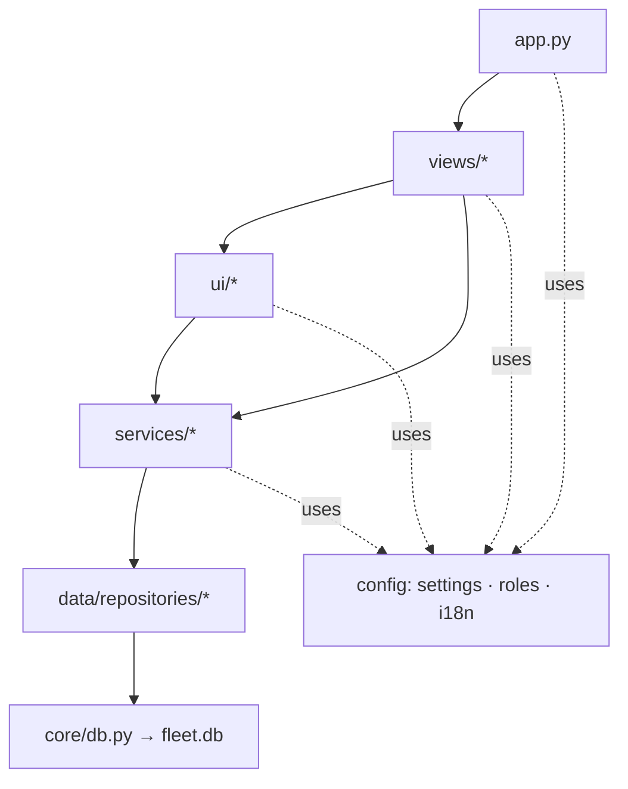

# Balkan Car Rentals — Fleet Console v3.0 · Code Documentation

Developer-facing documentation for the rental-fleet web application. For
non-technical install/usage instructions, see [`README_SETUP.md`](README_SETUP.md).

> **What this app is.** A single-page [Streamlit](https://streamlit.io/) web app
> that a small car-rental business uses to track its fleet, create and close
> rentals, manage customers, watch occupancy on a live timeline, and see revenue.
> It is multilingual (six UI languages — Turkish, English, German, Italian,
> Spanish, and Albanian), role-gated, and self-bootstrapping: on first launch it
> builds its own SQLite database and seeds the fleet from a CSV.

---

## Table of contents

1. [Tech stack](#1-tech-stack)
2. [Project layout](#2-project-layout)
3. [Architecture & layering](#3-architecture--layering)
4. [Application lifecycle (`app.py`)](#4-application-lifecycle-apppy)
5. [Data model](#5-data-model)
6. [Module reference](#6-module-reference)
7. [Cross-cutting concerns](#7-cross-cutting-concerns)
8. [Key workflows](#8-key-workflows)
9. [Running & configuration](#9-running--configuration)
10. [Extending the app](#10-extending-the-app)
11. [Notes, gotchas & known discrepancies](#11-notes-gotchas--known-discrepancies)

---

## 1. Tech stack

| Concern | Choice | Version | Notes |
|---|---|---|---|
| UI / runtime | Streamlit | 1.58.0 | Whole app is one server-rendered page; reruns top-to-bottom on every interaction. |
| ORM / DB access | SQLAlchemy Core | 2.0.51 | Used as a thin query layer over SQLite (no ORM models — raw `text()` SQL). |
| Database | SQLite | (stdlib) | File `fleet.db`; WAL mode + foreign keys on. Engineered so a move to Postgres is mostly a connection-string change. |
| Data wrangling | pandas | 3.0.2 | CSV seed import + dataframe tables/charts. |
| Password hashing | bcrypt | 5.0.0 | Per-password salt, slow by design. |
| Top navigation | native `st.button`s | — | Section menu built from plain buttons in `ui/nav.py` (no third-party nav component — see §11). |
| Cookies | extra-streamlit-components | 0.1.81 | `CookieManager` for the "remember me" session cookie. |
| Timeline | vis-timeline 7.7.3 | (CDN) | Loaded in-browser via an embedded HTML component. |
| Fonts | Inter + Space Grotesk | (Google Fonts CDN) | Loaded at runtime; needs internet on first paint. |

Pinned exactly in [`requirements.txt`](requirements.txt) so behaviour matches the
tested build.

---

## 2. Project layout

```
balkan_fleet/
├── app.py                     # Entrypoint: bootstrap → auth gate → nav → route
├── requirements.txt           # Pinned dependencies
├── fleet_master.csv           # One-time vehicle seed source (13 cars)
├── fleet.db                   # SQLite DB (created on first run; + .db-wal/.db-shm)
├── start_balkan_fleet.bat     # Windows launcher (installs deps, runs streamlit)
├── README_SETUP.md            # Non-technical setup & usage guide
├── DOCUMENTATION.md           # ← this file (architecture & module reference)
├── WALKTHROUGH.md             # Phase-by-phase, per-page user walkthrough
├── CLAUDE.md                  # Condensed agent-oriented guide (auto-loaded)
│
├── .streamlit/
│   └── config.toml            # Streamlit theme + server options
│
├── config/                    # Constants & policy — no DB, no Streamlit widgets
│   ├── settings.py            # Paths, brand, currency, LANGUAGES, status vocabularies
│   ├── roles.py               # RBAC: roles, permission→level map, can()
│   ├── i18n.py                # TR/EN dicts inline + de/it/es/sq merged in + t()
│   ├── terms.py               # Rental terms & conditions (six languages)
│   ├── lang_de.py             # German UI + TERMS dicts (auto-generated)
│   ├── lang_it.py             # Italian UI + TERMS dicts (auto-generated)
│   ├── lang_es.py             # Spanish UI + TERMS dicts (auto-generated)
│   └── lang_sq.py             # Albanian UI + TERMS dicts (auto-generated)
│
├── core/                      # Database foundation
│   ├── db.py                  # Engine, pragmas, init_db(), migrations, seeding
│   └── schema.sql             # Canonical DDL (9 tables + indexes)
│
├── data/
│   ├── repositories/          # All SQL lives here — one module per entity
│   │   ├── vehicles.py        # Fleet CRUD + ID generation + counts
│   │   ├── rentals.py         # Create/list/cancel/return + invoice/overdue data
│   │   ├── customers.py       # get-or-create + directory listing
│   │   ├── users.py           # Accounts + login sessions
│   │   ├── vehicle_costs.py   # Operating-cost ledger (insurance, fuel, …)
│   │   ├── audit.py           # Append-only audit trail
│   │   ├── licenses.py        # License records CRUD (super-admin)
│   │   └── app_settings.py    # Editable key/value settings (business name, logo)
│   └── seed/
│       └── import_csv.py      # CSV → vehicles, INSERT OR IGNORE (idempotent)
│
├── services/                  # Business logic — orchestrates repositories
│   ├── auth_service.py        # Hashing, login, sessions, account management
│   ├── scheduling_service.py  # Return-time math + availability (interval overlap)
│   ├── finance_service.py     # Revenue + cost + P&L (monthly/yearly/per-vehicle)
│   └── audit_service.py       # Convenience wrapper over the audit repo
│
├── views/                     # One render_*(user) function per top-nav section
│   ├── dashboard.py           # Home: signed-in identity title + KPIs + booking + fleet table
│   ├── reservations.py        # Active-rental cards + booking + timeline
│   ├── fleet.py               # Single action table (Add/Edit/Archive popups + status buttons)
│   ├── customers.py           # Card grid + per-customer & invoice pop-up dialogs
│   ├── finance.py             # KPIs + monthly chart + per-vehicle table
│   └── settings.py            # Business / License / Users / Profile tabs
│
└── ui/                        # Reusable presentation widgets & chrome
    ├── theme.py               # CSS variables, fonts, component styling
    ├── nav.py                 # Sticky top bar + language switch + role menu
    ├── auth_view.py           # Login form + session-restore gate
    ├── components.py          # format_eur, headers, badges, KPI tiles
    ├── booking.py             # Availability search + quick-rental form + invoice
    ├── invoice.py             # Print-ready rental invoice (HTML, with logo)
    ├── license_invoice.py     # Print-ready license invoice (HTML, with logo)
    ├── photos.py              # Vehicle photo + company-logo encoding/caching
    └── timeline.py            # vis-timeline HTML generator
```

Every directory has an empty `__init__.py` marking it as a package.

---

## 3. Architecture & layering

The app follows a strict, one-directional dependency flow. Higher layers call
lower ones; lower layers never import upward.

```
        ┌─────────────────────────────────────────────┐
        │  app.py  (bootstrap, auth gate, router)       │
        └───────────────┬─────────────────────────────┘
                        │
        ┌───────────────▼─────────────┐   ┌──────────────────────┐
        │  views/   (per-section UI)  │──▶│  ui/  (widgets/chrome)│
        └───────────────┬─────────────┘   └──────────┬───────────┘
                        │                            │
        ┌───────────────▼─────────────────────────────▼───────────┐
        │  services/   (business logic)                            │
        └───────────────┬─────────────────────────────────────────┘
                        │
        ┌───────────────▼─────────────────────────────────────────┐
        │  data/repositories/   (all SQL — one module per entity)  │
        └───────────────┬─────────────────────────────────────────┘
                        │
        ┌───────────────▼─────────────┐   ┌──────────────────────┐
        │  core/db.py  (engine)       │   │  config/ (constants,  │
        │  core/schema.sql            │   │  roles, i18n)         │
        └─────────────────────────────┘   └──────────────────────┘
                        │
                  ┌─────▼─────┐
                  │ fleet.db  │  (SQLite, WAL)
                  └───────────┘
```



**Layer responsibilities**

| Layer | Knows about | Must NOT |
|---|---|---|
| `config/` | nothing but Python stdlib + Streamlit `session_state` (i18n only); `settings.py`, `terms.py`, and the `lang_*.py` modules are Streamlit-free | touch the DB |
| `core/` | the SQLite file & schema | contain business rules |
| `data/repositories/` | SQL & table shapes; returns plain `dict`s | hash passwords, render UI, or enforce roles |
| `services/` | repositories + policy (hashing, availability math, revenue rollups) | render UI |
| `ui/` & `views/` | Streamlit widgets, services, and `config` | write SQL directly |

The one deliberate convention worth remembering: **repositories return plain
dictionaries**, never ORM objects, so the layers above are decoupled from
SQLAlchemy.

---

## 4. Application lifecycle (`app.py`)

Streamlit re-executes the whole script top-to-bottom on every user interaction.
[`app.py`](app.py) defines that sequence:

1. **`st.set_page_config(...)`** — wide layout, collapsed sidebar, brand title/icon.
2. **`_bootstrap()`** — wrapped in `@st.cache_resource` so it runs **once per
   server process**. Calls `init_db()` (schema + migration + seeding + default
   admin).
3. **`init_lang()`** — seeds `session_state.lang = "tr"` if unset.
4. **`inject_theme()`** — injects the global CSS (fonts, tokens, component styles).
5. **Cookie manager** — `stx.CookieManager(key="bcr_cm")` is created **exactly
   once per run** (creating it twice raises duplicate-component errors), then
   `get_all()` reads current cookies.
6. **Priming rerun** — cookies only arrive on the *second* browser round-trip, so
   on a fresh session the app does one silent `st.rerun()` (guarded by
   `_primed`) to make "remember me" restore work on first load.
7. **Auth gate** — `auth_view.ensure_authenticated(...)` either returns the
   logged-in `user` dict or renders the login form and calls `st.stop()`.
8. **Top nav** — `top_nav(user, ...)` draws the sticky bar and returns the
   selected page key.
9. **Router** — a dict maps the page key to a `render_*(user)` function;
   unknown keys fall back to the dashboard.

The `user` object passed everywhere is a small dict:
`{"username": str, "full_name": str, "role": str}`.

---

## 5. Data model

Defined in [`core/schema.sql`](core/schema.sql). SQLite, executed once on first
run (`CREATE ... IF NOT EXISTS` makes re-running safe).

**Conventions**
- **Money is `INTEGER` cents everywhere** — no floats, no rounding drift. It is
  converted to a display string only at the edge via `ui.components.format_eur`.
- **Dates/times are ISO-8601 text** (`YYYY-MM-DDTHH:MM:SS`).
- Status vocabularies are enforced with `CHECK` constraints **and** mirrored in
  `config/settings.py` — keep the two in sync.

### Tables

| Table | Key | Purpose |
|---|---|---|
| `vehicles` | `vehicle_id` (TEXT, e.g. `C001`) | The fleet. Soft-deleted via `status='DELETED'`. |
| `customers` | `customer_id` (AUTOINCREMENT) | Everyone ever rented to. |
| `rentals` | `deal_id` (TEXT, e.g. `RENT-202606-001`) | Rental contracts; `status` Active/Closed. |
| `charges` | `charge_id` | Income ledger: `rental`, `overdue_penalty`, `damage`, `deposit`, `refund`. Feeds Finance. |
| `vehicle_costs` | `cost_id` | Operating-cost ledger (insurance, maintenance, depreciation, fuel, financing, registration, other). Powers the Finance cost/P&L tabs. |
| `users` | `user_id` | Accounts: `username`, bcrypt `password_hash`, `role`, `is_active`. |
| `sessions` | `token_hash` | "Remember me" — stores only the SHA-256 of the cookie token + `expires_at`. |
| `audit_log` | `id` | Append-only action trail; written on every privileged mutation, viewed in Settings → Activity. |
| `licenses` | `license_id` | Annual-license records: `licensee`, `year`, `years`, `amount` (cents), `purchase_date`, `notes`, `created_at`. Managed in Settings → License (super-admin). |
| `app_settings` | `key` | Editable settings (`business_name`, plus `logo` — a base64-encoded PNG of the company logo). |

### Relationships

```
customers 1───∞ rentals ∞───1 vehicles
                   │                │
                   │ (deal_id)      │ (vehicle_id)
                   └──────∞ charges ∞┘
                                    │
                          vehicle_costs ∞───1 vehicles
```

- `rentals.customer_id → customers.customer_id`
- `rentals.vehicle_id → vehicles.vehicle_id`
- `charges.deal_id → rentals.deal_id`, `charges.vehicle_id → vehicles.vehicle_id`
- Foreign keys are enforced (`PRAGMA foreign_keys = ON`).

### Indexes

`idx_rentals_vehicle`, `idx_rentals_status`, `idx_rentals_interval(vehicle_id,
start_dt, end_dt)`, `idx_charges_deal`, `idx_costs_vehicle`. The interval index
is what keeps availability checks fast (see §8).

### ID generation

| Entity | Format | Where |
|---|---|---|
| Vehicle | `C` + zero-padded number, e.g. `C014` | `vehicles._next_id()` — max existing `C###` + 1 |
| Rental | `RENT-YYYYMM-NNN` | `rentals.next_deal_id()` — per-month counter |
| Customer | integer autoincrement | DB |

---

## 6. Module reference

### `config/`

**`settings.py`** — single source of truth for paths (`BASE_DIR`, `DB_PATH`,
`SEED_CSV`), brand (`APP_NAME`, `APP_TAGLINE`, `APP_VERSION="3.0"`, `PAGE_ICON`),
currency (`CURRENCY_SYMBOL="€"`, `CURRENCY_CODE="EUR"`), the language registry
(`LANGUAGES` — code → "flag + endonym" — and `STAFF_ONLY_LANGS={"sq"}`; see
*Internationalisation*), the status vocabularies (`VEHICLE_STATUSES`,
`RENTAL_STATUSES`), the `STATUS_TOKEN` map (status → design-token name resolved to
a colour in `ui/theme.py`), and booking defaults (`DEFAULT_PICKUP_HOUR=10`,
`DEFAULT_RENTAL_DAYS=3`). This module is **Streamlit-free**, so the service layer
can validate a language code without pulling in `i18n.py`.

**`roles.py`** — RBAC. Four roles, ranked by level:

| Role (internal) | Level | Display (EN / TR) |
|---|---|---|
| `super_admin` | 3 | Super Admin / Süper Yönetici |
| `admin` | 2 | Admin / Yönetici |
| `employer` | 1 | Employee / Çalışan |
| `visitor` | 0 | Visitor / Ziyaretçi |

Permissions map to a **minimum level** (`PERMISSION_MIN_LEVEL`); access is just
`role_level(user) >= needed`. Public API:
- `role_level(user) -> int`
- `can(user, permission) -> bool` — the single check the rest of the app uses.
- `assignable_roles(actor) -> list[str]` — which roles a user may grant (super-
  admins grant any; admins grant only `employer`/`visitor`).

Permission keys: `view_dashboard`, `view_reservations`, `view_fleet`,
`create_reservation`, `cancel_reservation`, `edit_fleet`, `soft_delete_vehicle`,
`view_finance`, `manage_users`, `assign_admin_roles`, `hard_delete_vehicle`,
`edit_business_settings`.

**`i18n.py`** — the `TRANSLATIONS` dict, one block per UI language. The **Turkish
and English** blocks are defined **inline** here; the four added languages
(**German, Italian, Spanish, Albanian**) live in their own auto-generated modules
(`config/lang_de.py`, `config/lang_it.py`, `config/lang_es.py`, `config/lang_sq.py`),
each exposing a plain `UI` dict — `i18n.py` imports each `UI` and assigns it to
`TRANSLATIONS["de"/"it"/"es"/"sq"]`. `init_lang()` defaults to Turkish
(`DEFAULT_LANG="tr"`); `t(key)` looks up the current `session_state.lang`, falling
back to English, then to the raw key. All six key-sets are **identical at 334 keys
each**. Status labels and role labels are themselves translation keys. (See
*Internationalisation* in §7 and *Add a language* in §10.)

**`terms.py`** — `RENTAL_TERMS`, the rental terms & conditions (a `title` plus 12
rules) used by the print-ready invoice, in all six languages. The TR/EN text is
inline; the other four are imported as the `TERMS` dict from the matching
`config/lang_<code>.py` module. `terms_for(lang)` returns the block, falling back
to English.

**`lang_de.py` / `lang_it.py` / `lang_es.py` / `lang_sq.py`** — one
auto-generated module per added language. Each defines exactly two plain dicts:
`UI` (every UI string, merged into `TRANSLATIONS` by `i18n.py`) and `TERMS` (the
invoice terms, merged into `RENTAL_TERMS` by `terms.py`). They import neither
Streamlit nor any project module.

### `core/`

**`db.py`** — database foundation.
- `get_engine()` — lazily creates a single shared SQLAlchemy engine; on connect
  it sets `PRAGMA foreign_keys = ON` and `PRAGMA journal_mode = WAL`.
- `init_db()` — idempotent boot: runs `schema.sql`, runs `_migrate_users()`,
  seeds vehicles from CSV **if the table is empty**, then `ensure_default_admin()`.
- `_migrate_users()` — Phase-1 safety: if the `users` table lacks the `full_name`
  column it is dropped and recreated (safe because no real accounts existed yet).
- `_run_schema()` uses raw `sqlite3.executescript` (handles comments + multiple
  statements); everything else uses SQLAlchemy.

**`schema.sql`** — the DDL described in §5.

### `data/repositories/`

All SQL is here. Each function opens a short-lived connection from the shared
engine (`.connect()` for reads, `.begin()` for write transactions).

- **`vehicles.py`** — `list_vehicles(include_deleted=False)`, `get_vehicle(id)`,
  `fleet_counts()` (total/available/rented/garage), `add_vehicle(...)` (assigns
  the next `C###` id), `update_vehicle(...)`, `set_status`, `soft_delete`
  (→`DELETED`), `restore_vehicle` (→`Available`), `hard_delete` (row `DELETE`).
- **`rentals.py`** — `next_deal_id()`, `list_active_rentals_with_vehicle()`,
  `list_all_rentals()`, `list_rentals_for_customer(cid)`, `create_rental(...)`
  (inserts the rental + a `rental` charge + optional `deposit` charge and flips
  the car to `Rented`, all in one transaction), `cancel_rental(deal_id)` (close +
  free the car), `settle_and_close(...)` (the return workflow — see §8), plus the
  invoice sources `get_rental_full(deal_id)` and `list_charges_for_deal(deal_id)`.
- **`customers.py`** — `get_or_create_customer(name, phone, id)` (dedupes on
  name+phone), `list_customers()` (with rental counts + last-rental date).
- **`users.py`** — account CRUD (`get_user`, `list_users`, `count_users`,
  `insert_user`, `update_password`, `update_role`, `set_active`) and session
  storage (`insert_session`, `get_session`, `delete_session`,
  `purge_expired_sessions`). **This layer never hashes** — it stores whatever
  `auth_service` hands it.
- **`vehicle_costs.py`** — operating-cost ledger. `COST_TYPES`, `add_cost(...)`,
  `list_costs(limit)`, `delete_cost(id)`, and the aggregates `cost_total()`,
  `cost_by_type()`, `cost_by_month()`, `cost_by_year()`, `cost_by_vehicle()`.
- **`audit.py`** — `record(username, action, entity, entity_id, detail)`
  (best-effort, never raises) and `list_recent(limit)`.
- **`licenses.py`** — license-record CRUD: `list()` (records newest-first),
  `get(license_id)`, `add(...)`, `update(...)`, `delete(license_id)`. Amounts are
  integer cents.
- **`app_settings.py`** — `get_setting/set_setting` (UPSERT) plus
  `get_business_name()`/`set_business_name()`, which fall back to `APP_NAME`, and
  the company-logo accessors `get_logo()`/`set_logo(b64)`/`clear_logo()` (the logo
  is stored as a base64 PNG under the `logo` key).

### `data/seed/`

**`import_csv.py`** — reads [`fleet_master.csv`](fleet_master.csv) and inserts
rows with `INSERT OR IGNORE` keyed on `vehicle_id`, so it never duplicates or
overwrites in-app edits. Helper coercers (`_to_cents`, `_to_int`, `_to_str`)
tolerate messy values and currency symbols (`€`/`$`/commas). The rate column is
read from `Base Daily Rate (€)`, falling back to the legacy `($)` header. Called
automatically by `init_db()` on an empty fleet, or runnable by hand:
`python -m data.seed.import_csv`.

### `services/`

- **`auth_service.py`** — the security layer. bcrypt `hash_password` /
  `verify_password`; `ensure_default_admin()` (seeds `admin`/`admin` as
  `super_admin` if no users exist); `authenticate(username, password)`; session
  helpers `create_session(username, remember)` → returns a URL-safe token (only
  its SHA-256 is stored), `validate_session(token)`, `destroy_session(token)`;
  and account management `create_user`, `change_password`, `set_user_role`,
  `set_user_active`, `set_user_full_name` (own-profile edit →
  `users.update_full_name`), `all_users`, and the lockout guard
  `is_last_active_super_admin(username)` (used by the Users tab to protect the final
  active super-admin). Constants: `MIN_PASSWORD_LEN=6`, `REMEMBER_DAYS=30`,
  `SESSION_HOURS=12`.
- **`scheduling_service.py`** — `compute_return(start_date, start_time, days,
  return_time)` returns the promised return `datetime`; `available_vehicles(
  req_start, req_end)` runs an indexed interval-overlap query (two intervals
  overlap when `max(start_a,start_b) < min(end_a,end_b)`) to list cars free for
  the window, excluding `DELETED`/`In Garage`/`Maintenance`/`Rented`.
- **`finance_service.py`** — income, cost, and combined profit-and-loss. Income:
  `revenue_summary()`, `revenue_by_vehicle()`, `revenue_by_month()`,
  `revenue_by_year()`. Cost (via the vehicle_costs repo): `cost_total()`,
  `cost_by_type()`. Combined: `pnl_summary()` (income/cost/net/margin),
  `pnl_by_month()`, `pnl_by_year()`, `profit_by_vehicle()`. `_merge(...)` unions
  income and cost rows on a period key. All amounts in cents; deposits/refunds are
  excluded from revenue.
- **`audit_service.py`** — `record(user, action, entity, entity_id, detail)` (pulls
  the username from the `user` dict) and `recent(limit)`. Thin wrapper over the
  audit repository.

### `ui/`

- **`theme.py`** — `inject_theme()` writes a `<style>` block: imports the two
  Google fonts, defines colour tokens as CSS variables, and styles badges, KPI
  tiles, headers, the "calculated return" box, and buttons. `TOKENS` is the
  colour palette.
- **`nav.py`** — `top_nav(user, cookie_mgr, cookies)` renders the sticky bar:
  business name, signed-in identity, logout, and a horizontal **section menu of
  compact icon-only `st.button`s** (one
  per visible section; a single emoji that never wraps, with the section name in a
  hover tooltip and the active one `type="primary"`). The **Finance** item is
  hidden unless `can(user, "view_finance")`. Selection persists in
  `session_state.current_page`.
- **`auth_view.py`** — `ensure_authenticated(...)` (session restore or login +
  `st.stop()`), `_render_login(...)`, and `logout(...)` (destroy server session,
  delete cookie, clear session_state). Cookie name: `bcr_session`.
- **`components.py`** — `format_eur(cents)` (the one money-formatter; whole
  amounts drop decimals), `page_header`/`section_header` (title + hover info
  dot), `status_badge(status)`, `kpi_tile(label_key, value, accent=False)`.
- **`booking.py`** — `render_booking_panel(user, key_prefix)`: left column =
  availability/return calculator; right column = available-car picker + the quick
  rental form with a **live euro total** (`st.metric`). Reused by both the
  dashboard and reservations pages (distinct `key_prefix` avoids widget-key
  clashes). Creating a rental requires `create_reservation`; lower roles still
  see availability. After a successful save it stashes the new `deal_id` in
  `session_state` and `_render_invoice_result(...)` shows the print-ready invoice
  until dismissed; the action is recorded to the audit log.
- **`invoice.py`** — `build_invoice_html(deal, charges, business_name, lang=...,
  logo=...)` returns a complete standalone invoice document (business header,
  bill-to, vehicle, period, line items from the rental's charges, a subtotal, a
  `− Deposit` deduction row, the grand total (subtotal − deposit = balance due),
  the rental terms in the chosen language, a print button, and a
  signed/unsigned chip). When a `logo` (base64 PNG) is supplied it is injected into
  the `.brand` header. The `lang` argument is validated against `LANGUAGES`, and
  `render_invoice(deal_id, key_prefix=..., lang=...)` (which passes
  `app_settings.get_logo()`) offers a language picker spanning **all six
  languages** — a customer document is independent of the UI-language role gating,
  so Albanian is available here regardless of role. It shows the invoice inline and
  offers a download; `@media print` hides the toolbar so the printout is clean.
- **`license_invoice.py`** — print-ready license invoice for a license record,
  built the same way as the rental invoice and likewise fetching
  `app_settings.get_logo()` to render the company logo in the header.
- **`photos.py`** — image encoding/caching. Vehicle photos are cropped to a fixed
  `PHOTO_SIZE`; `encode_logo(...)` instead **fits** the image aspect-preserved
  within **280×100** (not cropped) and returns a base64 PNG for `app_settings`.
- **`timeline.py`** — `render_timeline(vehicles, rentals)` builds a self-contained
  HTML doc using vis-timeline (from CDN) and embeds it with
  `components.html`. One group row per vehicle; bars are blue (`rented`) or red
  (`overdue`, when `end_dt < now`). Wheel pans (zoom is via the +/− buttons); a
  labelled "NOW"/"ŞİMDİ" custom time line marks the present.

### `views/`

Each exposes one `render_<name>(user)` function, called by the router.

- **`dashboard.py`** — the **Home** page (nav label key `nav_dashboard`). Its title
  is the signed-in user shown as **👤 `<full_name>` — `<role label>`** (resolved via
  `ROLE_LABEL_KEY`), not the former "Overview" heading. Below it: timeline → 4 KPI
  tiles → booking panel → searchable fleet table.
- **`reservations.py`** — reordered to reduce overlap with Home, the render order is
  now **active-rental cards (top) → quick rental registration → timeline/calendar
  (bottom)**. It no longer early-returns when there are no active rentals — the
  booking panel and calendar still render. Each card shows customer/vehicle/period,
  an **OVERDUE** badge with hours-late (`_overdue_hours`), a **Cancel** button, and
  a **Manage / Return** expander that posts overdue + damage charges and closes the
  rental. Gated by `cancel_reservation`; cancel/return are audited.
- **`fleet.py`** — a single **action table** (the old Add/Edit/Delete tabs are
  gone). An **➕ Add Vehicle** popup (needs `edit_fleet`) sits above a table whose
  **Actions** column opens **Edit** and **Delete/Archive** as `st.dialog` popups
  (archive needs `soft_delete_vehicle`, permanent delete needs
  `hard_delete_vehicle`), and whose **dynamic Status** column shows **To-Garage /
  To-Maintenance / Make-Available** buttons that call `vehicles.set_status`
  immediately (not via a dialog). Non-privileged roles see the table read-only. The
  archived-vehicle restore list is kept (an expander/dialog). `_EDITABLE_STATUSES`
  is just `["Available","Maintenance"]` (manual `Rented` was removed); both the
  edit-dialog selectbox and the status-column quick buttons are **disabled/locked
  when the vehicle has an active rental** (`rentals.vehicle_has_active_rental`), and
  the edit dialog shows a lock notice (i18n key `status_locked_rented`).
- **`customers.py`** — a **minimalist card view**: one compact card per customer
  (name, phone, rental count, last-rental date, registered-by) in a **3-up grid**,
  with a search box. A page-level **Open Full Table** button (`t("open_full_table")`)
  pops the whole customers table in a dialog. Each card's **Open** button
  (`t("card_open")`) pops a **per-customer dialog** holding an edit-details form
  (Employee+), the rental-history table, and the reassign control (Admin+).
  - The rental-history table has a **Print Invoice** column whose cells are one
    small flag button per available language (Albanian flag only for staff). A flag
    opens that rental's invoice in its **own** pop-up dialog in that language.
    Because Streamlit allows only **one** `st.dialog` open at a time (no nesting),
    the flag buttons don't nest a dialog: they stash a one-shot `(deal_id, lang)` in
    `session_state["cust_invoice"]` and call `st.rerun()` (closing the customer
    dialog); a dispatch at the top of `render_customers()` re-opens it as a
    standalone invoice dialog. (See §11.)
  - **Reassign "Registered By"** (Admin+) identifies the rental by the **customer's
    full name** — the selectbox is labelled with the name and each option leads with
    the full name plus car/period to disambiguate — rather than the raw
    contract/deal id.
- **`finance.py`** — guarded by `view_finance`. Headline KPIs (total revenue,
  total cost, net profit, profit margin) over five tabs: **Overview** (revenue mix
  + cost-by-type), **Monthly** and **Yearly** (income-vs-cost bar chart + net
  table), **By Vehicle** (per-car profitability), and **Costs** (record/delete
  operating costs). Cost mutations are audited.
- **`settings.py`** — tabs assembled by permission (helper-per-tab, stable order):
  **Business** (admin+ — editing the business **name** stays super-admin
  (`edit_business_settings`), but the **company-logo** upload/remove is available to
  admin+; the logo is encoded by `ui.photos.encode_logo` and stored via
  `app_settings.set_logo`/`clear_logo`), **License** (super-admin — see below),
  **Language** (everyone — a per-user picker built from the `LANGUAGES` registry,
  with `STAFF_ONLY_LANGS` filtered out below role level 1 so visitors don't see
  Albanian; saved via `auth_service.set_user_lang`), **Users** (admin+,
  `manage_users` — create users, change roles within `assignable_roles`,
  activate/deactivate; you can't change your own role/active state, and the
  role-change/deactivate controls are **disabled for the final active super-admin**
  via `auth_service.is_last_active_super_admin` so it can't be demoted or
  deactivated), **Profile** (everyone — label key `tab_profile`; lets a user edit
  their **own** Full Name via `auth_service.set_user_full_name` →
  `users.update_full_name`, Email, and Password), and **Activity** (admin+ — the
  audit log). User/role/business changes are audited.

  The **License** tab lists the `licenses` records (via `data/repositories/licenses.py`)
  with per-row **Edit** (dialog), **Delete** (dialog), and **Print-invoice** (dialog)
  actions, plus an **Add** form. Adding or editing a record for a later year calls
  `licensing_service.extend_licensed_year()` to push out the date-picker cap. The
  "unlock next year" button and the **SMTP** configuration section remain on this tab.

---

## 7. Cross-cutting concerns

### Authentication & sessions
- Passwords: **bcrypt** with per-password salt (replaced an older unsalted
  SHA-256).
- "Remember me": a 256-bit URL-safe token is placed in the `bcr_session` cookie;
  only its **SHA-256 hash** is stored in `sessions`. A DB leak therefore can't be
  replayed as a cookie. Remember-me ON → 30-day token; OFF → 12-hour token + a
  session cookie that dies with the browser.
- The cookie round-trip is why `app.py` performs one priming `st.rerun()` on a
  fresh session.

### Authorization (RBAC)
Every privileged action is wrapped in `can(user, "<permission>")`. UI is hidden
*and* actions are guarded, but note the guards are UI-level (this is a trusted-
operator internal tool, not a public multi-tenant service).

### Auditing
Every privileged mutation calls `audit_service.record(user, action, entity,
entity_id, detail)` right after it succeeds (rental create/cancel/return, fleet
add/edit/archive/delete/restore, cost add/delete, user create/role/active, business
rename, password change). The trail is append-only and viewable in **Settings →
Activity** (admin+). Logging is best-effort and never blocks the action.

### Internationalisation
All user-visible text flows through `t(key)`. There are **six selectable UI
languages** — Turkish (`tr`), English (`en`), German (`de`), Italian (`it`),
Spanish (`es`), and Albanian (`sq`) — registered in `config/settings.LANGUAGES`
(code → "flag + endonym"). Default language is Turkish (`DEFAULT_LANG="tr"`).
**Albanian is staff-only** (`STAFF_ONLY_LANGS={"sq"}`): it is offered only to
"parent" roles — `employer`/`admin`/`super_admin`, i.e. role level ≥ 1 — while
visitors see the other five.

Language is **per-user**: it is chosen in **Settings → Language**, validated
against `LANGUAGES` by `auth_service.set_user_lang`, and adopted on login/restore;
there is no top-bar toggle. TR and EN dictionaries are inline in `config/i18n.py`;
the other four come from the auto-generated `config/lang_<code>.py` modules. All
six key-sets are identical at **334 keys each**. Status and role labels are
translation keys too. The print-ready invoice can be rendered in **any** of the six
languages independently of the UI-language role gating (a customer document is not
gated by the staff-only rule).

### Money
Stored as integer cents end-to-end; only `format_eur` turns cents into a string.
Euro inputs in forms are multiplied by 100 before hitting repositories.

### Theming
Two layers: `.streamlit/config.toml` sets Streamlit's built-in theme; `ui/theme.py`
injects richer custom CSS (fonts, tokens, badges, KPI tiles, the timeline picks
up its own styles inside the embedded HTML).

---

## 8. Key workflows

### Create a rental (booking)
1. Operator picks start date/time, day count, and return time in `booking.py`.
2. `scheduling_service.compute_return` yields the return datetime; the live total
   updates as the negotiated rate changes.
3. `available_vehicles(req_start, req_end)` lists only cars free for the window
   (interval-overlap query against `idx_rentals_interval`).
4. On submit, `rentals.create_rental(...)` (one transaction):
   inserts the rental → inserts a `rental` charge (and a `deposit` charge if any)
   → flips the vehicle to `Rented`. Customer is found-or-created.
5. The new `deal_id` is stashed in `session_state` and a **print-ready invoice**
   (`ui/invoice.py`) is shown with print + download. The action is audited.

### Print a rental invoice
`ui/invoice.build_invoice_html(deal, charges, business_name, logo=...)` renders a
standalone HTML invoice from `rentals.get_rental_full()` +
`rentals.list_charges_for_deal()`; `render_invoice` passes the company logo from
`app_settings.get_logo()` so it shows in the header. It appears automatically right
after a rental is created; a Print button calls the browser's print dialog
(`@media print` hides the toolbar), and a download button saves the `.html` for the
client. The license invoice (`ui/license_invoice.py`) is rendered the same way and
likewise carries the logo.

### Record costs & evaluate profit
Operating costs are entered in **Finance → Costs** (`vehicle_costs.add_cost`).
`finance_service` then combines the `charges` income ledger with the
`vehicle_costs` expense ledger to produce income/cost/net **by month**, **by
year**, and **per vehicle**, plus the headline net-profit and margin KPIs.

### Return / settle a rental
`reservations.py` → expander → `rentals.settle_and_close(deal_id, vehicle_id,
late_cents, damage_cents, return_notes, contract_signed)` does, atomically:
- post an `overdue_penalty` charge (if late > 0),
- post a `damage` charge **and** add it to the vehicle's `maintenance_charge` (if
  damage > 0),
- set the rental `Closed` with notes + signed flag,
- flip the vehicle back to `Available`.

These charges immediately feed Finance.

### Overdue detection
Purely derived, never stored: a rental is overdue when `end_dt < now`. The
timeline colours such bars red; reservation cards compute hours-late via
`_overdue_hours` and show the **OVERDUE** badge.

### Fleet CRUD & archiving
Add (auto `C###` id) / Edit / **Archive** (`status='DELETED'`, reversible) /
**Hard delete** (row removed, super-admin only) / **Restore** (`→ Available`).

### User management
Super-admin seeds on first run (`admin`/`admin`). Admins create
`employer`/`visitor`; super-admins create any role (and may manage other
super-admins). Role grants are bounded by `assignable_roles(actor)`, so no one can
escalate beyond their own tier. A **last-super-admin guard**
(`auth_service.is_last_active_super_admin`) disables the role-change and deactivate
controls for the final active super-admin so it can never be demoted or
deactivated. Each role keeps a **Profile** tab (Settings) to edit their own full
name, email, and password.

### First-run bootstrap
Empty DB → `schema.sql` runs → `fleet_master.csv` seeds 13 cars → default
super-admin created. To fully reset: stop the app and delete `fleet.db`
(plus `fleet.db-wal` / `fleet.db-shm`).

---

## 9. Running & configuration

**Quick start (Windows):** double-click `start_balkan_fleet.bat` — it finds
Python, installs `requirements.txt`, and runs `streamlit run app.py`.

**Manual (any OS):**
```bash
python -m pip install -r requirements.txt
python -m streamlit run app.py        # macOS: python3
```
Sign in with `admin` / `admin`, then change the password in **Settings →
Profile** immediately.

**Configuration knobs**
- Brand / version / currency / booking defaults → `config/settings.py`.
- Streamlit theme + `runOnSave` → `.streamlit/config.toml`.
- Roles & permissions → `config/roles.py`.
- Languages registry → `LANGUAGES`/`STAFF_ONLY_LANGS` in `config/settings.py`.
- Translations → `config/i18n.py` (TR/EN inline; `de`/`it`/`es`/`sq` in
  `config/lang_<code>.py`); rental-terms text → `config/terms.py` (+ the same
  `lang_<code>.py` modules).
- Database location → `DB_PATH` in `config/settings.py`.

**Internet** is required on first paint of each screen (Google Fonts,
vis-timeline, the cookie/menu components load from CDNs).

---

## 10. Extending the app

**Add a page**
1. Create `views/<name>.py` with `def render_<name>(user): ...`.
2. Register it in `app.py`'s router dict and import it.
3. Add a `NAV_ITEMS` entry in `ui/nav.py` (page key, label key, emoji icon; the label shows as the button's hover tooltip).
4. Add the label translation key to **both** language blocks in `config/i18n.py`.
5. If gated, add a permission to `config/roles.py` and wrap with `can(...)`.

**Add a permission** — add `"<perm>": <min_level>` to `PERMISSION_MIN_LEVEL`,
then call `can(user, "<perm>")` at the use site.

**Add a language** — add the code → "flag + endonym" entry to `LANGUAGES` in
`config/settings.py` (and to `STAFF_ONLY_LANGS` if it should be staff-only), then
add a `config/lang_<code>.py` module exposing two plain dicts — `UI` (every UI
string, 334 keys mirroring the English block) and `TERMS` (the invoice title + 12
rules) — and wire it in by importing its `UI`/`TERMS` in `config/i18n.py` and
`config/terms.py`. (TR and EN stay inline in `i18n.py`/`terms.py`.) Optionally
change `DEFAULT_LANG`. The Settings → Language picker and the invoice language
menu pick up the new code automatically from `LANGUAGES`.

**Add a vehicle/rental field** — extend `schema.sql`, the relevant repository
function(s), and the form(s) in `views/fleet.py` / `ui/booking.py`. For an
existing DB you'll need a migration (see `_migrate_users` as a pattern) or a
reset.

**Switch the database to Postgres** — change the URL in `core.db.get_engine()`
and drop the SQLite-specific `PRAGMA`s; the repository SQL is mostly portable
(watch `strftime`, `GLOB`, and `INSERT OR IGNORE`/`INSERT OR REPLACE`, which are
SQLite-isms used in a few places).

---

## 11. Notes, gotchas & resolved discrepancies

**Resolved** (were flagged in earlier builds; fixed in this one):
- **Role naming.** The internal role id is `employer` but its display label is
  **Employee / Çalışan**. The stale "Operator" wording in `ui/booking.py` has been
  corrected; creating a rental requires the `create_reservation` permission
  (level 1 = `employer`/Employee and up).
- **Currency header.** The seed CSV header now reads `Base Daily Rate (€)` to match
  the app's euro currency; the importer still accepts the legacy `($)` header as a
  fallback, and `_to_cents` strips either symbol.
- **`STATUS_TOKEN["Overdue"]`** is now clearly commented as a *derived* state, not a
  stored vehicle status (a rental is overdue when `end_dt < now`); used only for
  colouring.
- **`vehicle_costs` and `audit_log` are now active.** `vehicle_costs` backs the
  Finance cost/P&L tabs; `audit_log` records every privileged mutation and is
  viewable in **Settings → Activity**.
- **Blank-pages bug (Streamlit multipage collision).** The section modules were
  originally in a folder named `pages/`. Streamlit reserves that name for its
  *native multipage app* — it auto-builds a sidebar listing each file and runs it
  standalone, so every section rendered blank. Fixed by renaming the folder to
  **`views/`** (updating `app.py`'s imports) plus `showSidebarNavigation = false`
  in `.streamlit/config.toml`. See §3/§6 and `ui/nav.py`.
- **Invisible top nav (`streamlit-option-menu`).** That component renders inside an
  iframe that collapses to **0px height** on Streamlit 1.58, hiding the whole
  section menu. Replaced with a **native `st.button` nav** in `ui/nav.py`; the
  dependency was dropped from `requirements.txt`.

**Standing notes / by-design:**
- **One `st.dialog` at a time (Customers print-invoice).** Streamlit allows only a
  single dialog open at once and won't nest one inside another. The Customers page
  works around this: a flag button inside the per-customer dialog does **not** open
  the invoice dialog directly — it stashes a one-shot `(deal_id, lang)` in
  `session_state["cust_invoice"]` and reruns (which closes the customer dialog), and
  a dispatch at the top of `render_customers()` re-opens it as a standalone invoice
  dialog. See `views/customers.py`.
- **UI-level authorization.** Permission checks gate the UI and the action calls,
  but there is no separate API boundary; this is an internal single-tenant tool.
- **Customer dedupe** is on `full_name` + `phone` (exact match). Different
  spellings or phone formats create distinct customer rows.
- **Audit logging is best-effort** — `audit.record` swallows errors so a logging
  failure can never abort the real action.
- **Invoice deposit handling** — the deposit is **deducted** from the subtotal: the
  invoice shows the subtotal, a `− Deposit` deduction row, and a grand total of
  subtotal − deposit (the remaining balance due).
- **First render needs the network** for CDN fonts/components; offline, screens
  render but look unstyled and the timeline won't load.
- **Resetting** the app (including users) means deleting `fleet.db` and its WAL/
  SHM sidecar files while the app is stopped.
```
